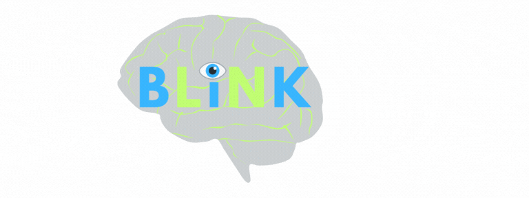

Rutgers · Department of Spanish &amp; Portuguese

<strong>BLiNK Lab</strong> — Bilingualism: Language in NeuroKognition

<h1>How do bilingual brains process and predict language in real time?</h1>

The BLiNK Lab, directed by Dr. Nuria Sagarra at Rutgers University, investigates typical and atypical language processing in bilingual and monolingual children and adults.

Our research examines how language experience and cognition shape the ability to understand and predict language in real time. We ask questions such as: How does working memory support second language processing? How do bilinguals predict morphology and syntax? How does language interact with emotion and the perception of chronic pain? How are languages best taught and assessed?

Our lab uses a range of methods to address these questions, including self-paced reading, eye-tracking, EEG, and cognitive measures.

<a class="cta" href="people.html">Meet the team</a>

<h2>News</h2>

FUNDING
<strong>New funded project.</strong> Dr. Sagarra's project on <em>Language Effects on the Perception of Chronic Pain</em> has won a $75,000 School of Arts and Sciences (SAS) Opportunity grant.

PUBLICATION
<strong>New paper.</strong> Fernández &amp; Sagarra (2025), <em>Languages.</em> <a href="publications.html">See publications →</a>

RECRUITING
<strong>Now recruiting.</strong> We are running new studies. <a href="participate.html">Participate →</a>

## Contact

For questions about the lab or our research, email
[blinklab.rutgers@gmail.com](mailto:blinklab.rutgers@gmail.com).
