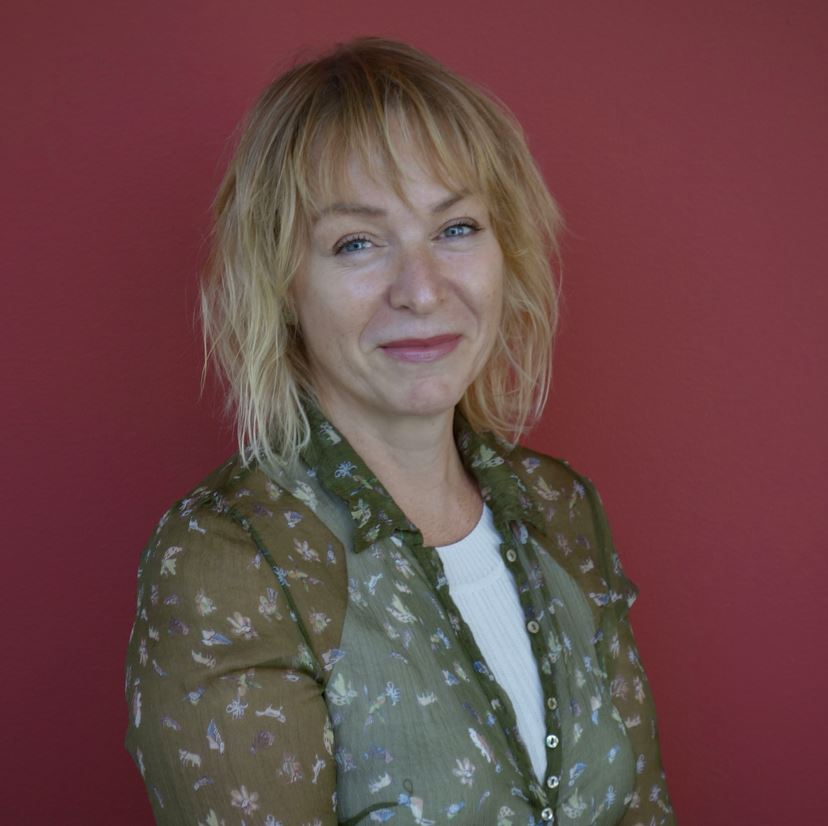
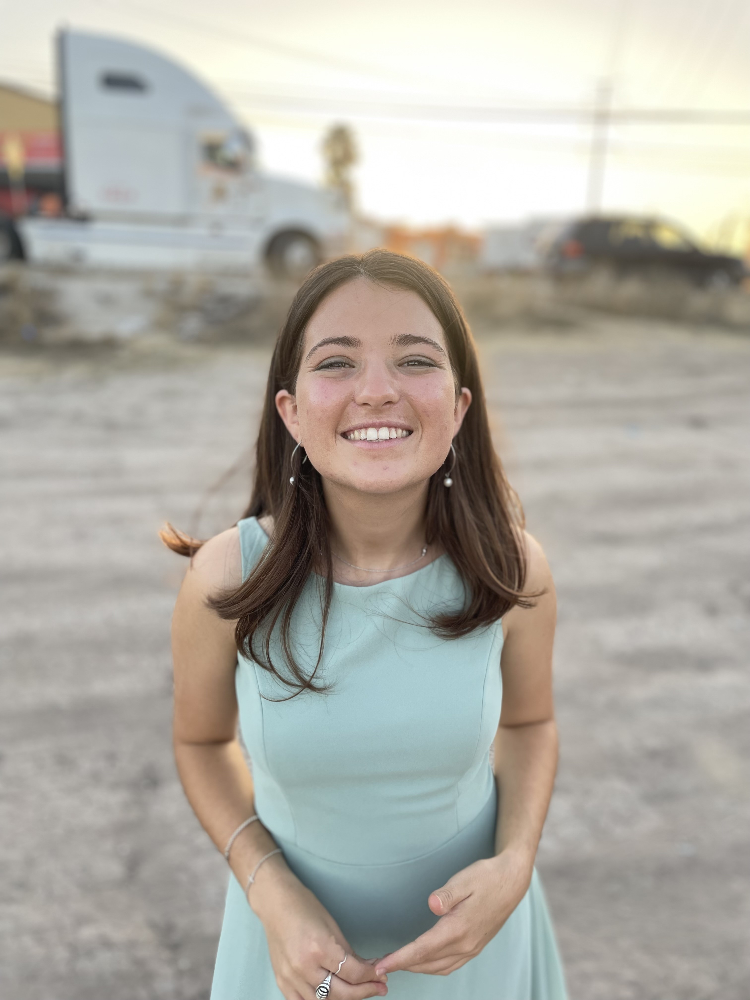
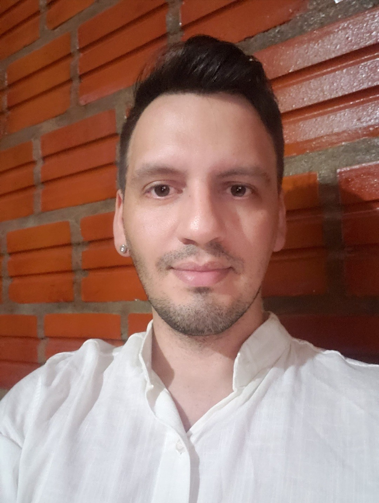
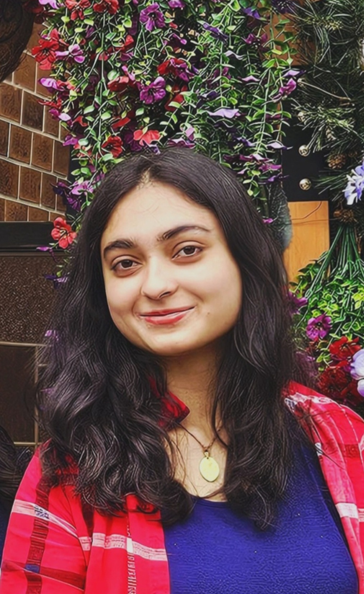
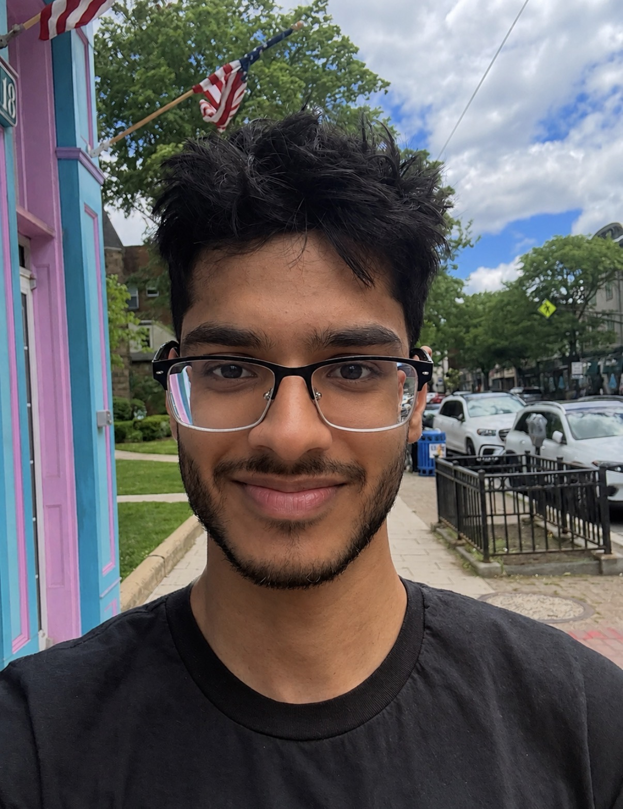
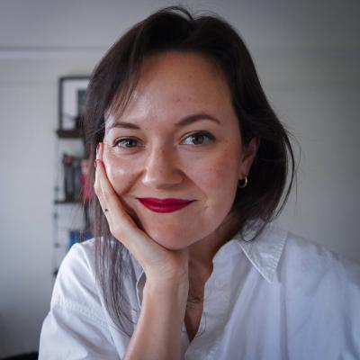

## Lab Director

**Dr. Nuria Sagarra** 
Director of the BLiNK Lab 
Professor, Department of Spanish and Portuguese

Dr. Nuria Sagarra is a Professor in the Department of Spanish and Portuguese at
Rutgers University, where she directs the BLiNK (Bilingualism: Language in
NeuroKognition) Lab. She holds affiliated appointments in the Department of
Pediatrics (Rutgers and Robert Wood Johnson Hospital) and the Rutgers Center
for Cognitive Science. Dr. Sagarra earned her Ph.D. in Spanish Linguistics from
the University of Illinois, Urbana-Champaign.

As a psycholinguist, Dr. Sagarra studies how language experience and individual
differences in cognition shape the way bilinguals form associations as they
process language in real time, work that aims both to deepen our understanding of
human cognition and to inform how languages are taught. She draws on 35 years in
language teaching and 25 years of academic leadership and research.

Dr. Sagarra's research has been supported by the National Science Foundation
and by international funders including the Spanish Ministry of Science and
Innovation and the Generalitat de Catalunya, and she currently leads a Rutgers
interdisciplinary research grant on the effects of language on the perception
of chronic pain. She is a recipient of the Chancellor Award for Excellence in
Service (Rutgers, 2026) and a Teaching Award from the Institute for Teaching
Innovation and Inclusive Pedagogy (2024), and she founded iRISE, a science
outreach initiative connecting Rutgers with New Jersey public schools.

[Faculty page](https://span-port.rutgers.edu/people/faculty/faculty-directory/452-nuria-sagarra)

## PhD Students

**Kaylee Fernandez** 
PhD Candidate

Kaylee's research focuses on the cognitive factors that affect bilingual
language processing. For her dissertation, she is examining how listeners use
prosody as a predictive cue during comprehension, using eye-tracking and EEG.
She helped develop a
[game](https://dinosaur-game-433dd.web.app) that trains second-language learners
of Spanish to perceive lexical stress, built in the BLiNK Lab in collaboration with
the Centre for Languages and Literature, Lund University, Sweden. She holds a B.A. in Spanish from the University of
Florida, an M.A. in Teaching Spanish as a Second Language from the Universidad de
Sevilla, and an M.Ed. in Applied Linguistics from Teachers College, Columbia
University, and a Graduate Certificate in Cognitive Science from Rutgers
University. She is a recipient of the University &amp; Louis Bevier Fellowship and
has over a decade of teaching experience.

**Eva Maria Corregidor Luna** 
PhD Student

Eva's research focuses on neurolinguistics and the relationship between
bilingualism and emotion.
She holds an M.A. in Spanish from San Diego State University and a B.A. in
Modern Languages and Translation from the Universidad de Alcalá de Henares.
Since 2021, she has taught college-level Spanish, literature, and linguistics
courses, and she collaborates with the [Language Bank](https://tlc.rutgers.edu/the-language-bank) at Rutgers University,
providing translation and interpreting services to local non-profits,
social-service organizations, and outreach initiatives.

**Héctor Wiscow** 
PhD Student

Héctor studies the cognitive science of bilingualism, with interests in the Foreign Language Effect, emotion, and the bilingual brain. He holds a B.A. in Foreign Language Teacher Education from Argentina and an M.A. in Spanish Language and Literatures from the University of Arkansas, Fayetteville. In 2020, he was awarded a Fulbright Scholarship as a Foreign Language Teaching Assistant in the United States, where he also served as a cultural ambassador for Argentina.

## Undergraduate Students

**Krupa Bhagat**

Krupa is an undergraduate at Rutgers majoring in Cell Biology and Neuroscience
with a double minor in Psychology and Art. She is interested in how the body's
physiological processes interact, as well as in predictive language processing.

**Anushka Dalal**

Anushka is an undergraduate at Rutgers University majoring in Biological
Sciences and minoring in Psychology. She is interested in bilingualism and the cognitive processes that influence
pain perception and patient experiences.

**Anthony Maldonado**

Anthony is an undergraduate at Rutgers University-New Brunswick pursuing a B.S.
in Cell Biology and Neuroscience with a minor in Spanish. He is interested in bilingualism and its practical applications in managing chronic clinical
conditions.

**Adarsh Patel**

Adarsh is an undergraduate at Rutgers University-New Brunswick majoring in Cell
Biology and Neuroscience with a minor in Data Science. His interests lie
at the intersection of language, cognition, neuroscience, and health.

**Ibrahim Siddiqui**

Ibrahim is an undergraduate at Rutgers University majoring in Psychology with a
minor in Biology. His interests include cognitive neuroscience, memory,
attention, and the neural mechanisms underlying behavior.

## Former Lab Members

**Dr. Ezequiel M. Durand-López** 
Assistant Professor of Hispanic Linguistics, College of Charleston

Dr. Durand-López specializes in Spanish morphology, psycholinguistics, and
second language acquisition. His work examines how second language learners
process word structure and gender agreement, and how working memory modulates
these processes, combining behavioral methods with transcranial direct-current
stimulation (tDCS). His broader interests span morphology, morphosyntax, and the
cognitive psychology of language learning.

[Faculty page](https://charleston.edu/spanish/faculty/durand-lopez-ezequiel.php) · [Personal website](https://edurandlopez.wordpress.com)

**Dr. Cristina Lozano-Argüelles** 
Assistant Professor, John Jay College of Criminal Justice (CUNY)

Dr. Lozano-Argüelles studies how interpreting experience shapes second language
processing, with a focus on the predictive strategies that distinguish
professional interpreters from other bilinguals. Her eye-tracking work shows how
the cognitive demands of simultaneous interpretation can sharpen anticipatory
processing and attentional control. Her current projects bridge theory and
practice: developing placement assessments for heritage speakers of Spanish (U.S.
Department of Education) and designing a bilingual curriculum for Criminal Justice
majors (National Science Foundation).

[Faculty page](https://www.jjay.cuny.edu/faculty/cristina-lozano-arguelles)

**Daniel Marotta**

Daniel is a graduate of Rutgers University with a B.A. in Cell Biology and
Neuroscience. He is interested in the neural correlates of information
processing, learning, and memory, and plans to continue this research as a
fellow at the National Institutes of Health.

